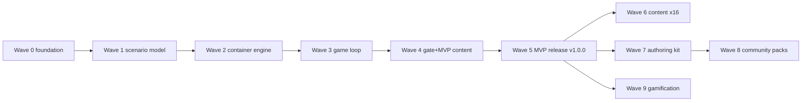

# DebugDungeon — Issue Plan

Status: Draft for review (2026-07-10)
Normative source for scope/waves/order. Each issue's full specification lives in
`docs/issues/NN-short-title.md`; GitHub Issues are derived from those files and are stale the
moment they disagree with this repo.

---

## 1. Completion statements

**v1.0.0 (MVP) completion:** when issues **01–39** are completed and each issue's Validation
section has passed, DebugDungeon v1.0.0 is complete: an installable (Homebrew / GitHub Releases),
documented, security-hardened CLI game with the full single-terminal game loop and 4 bundled
Floor-1 scenarios, with solvability and security regression gates in CI.

**v1 full completion:** when issues **01–66** are completed and validated, the entire planned
local-complete product is done: 20 bundled scenarios across 5 floors + capstone, the authoring
kit (`scenario init|validate|test`), community pack install with a trust gate, and gamification
(map/stats/achievements) — except for newly discovered implementation unknowns (§8), which must
be filed as new issues rather than absorbed silently.

No product behavior may live only in prose: if a behavior is in `docs/DESIGN.md` but not covered
by an issue in §2, that is a planning bug (see coverage table §5).

---

## 2. Issue list (recommended execution order)

Type: `eng` engineering, `scn` scenario content, `sec` security-critical, `doc` documentation,
`rel` release/CI. MVP = part of v1.0.0 gate.

| # | File | Title | Type | Wave | MVP |
|---|---|---|---|---|---|
| 01 | `01-repo-bootstrap.md` | Go module & repository scaffold | eng | 0 | ✔ |
| 02 | `02-ci-lint-test.md` | CI: lint + unit test workflow (hardened) | rel/sec | 0 | ✔ |
| 03 | `03-community-security-docs.md` | LICENSE, CONTRIBUTING, SECURITY.md, Code of Conduct | doc | 0 | ✔ |
| 04 | `04-cli-skeleton.md` | cobra CLI skeleton, global flags, exit-code contract | eng | 0 | ✔ |
| 05 | `05-paths-config.md` | State paths & config resolution | eng | 0 | ✔ |
| 06 | `06-logging-errors.md` | Debug logging & error presentation | eng | 0 | ✔ |
| 07 | `07-scenario-spec-loader.md` | Scenario spec types & strict YAML loader | eng | 1 | ✔ |
| 08 | `08-scenario-validator.md` | Scenario validator (structural/semantic/security) + JSON Schema | sec | 1 | ✔ |
| 09 | `09-content-hash.md` | Deterministic scenario content hash | eng | 1 | ✔ |
| 10 | `10-scenario-registry.md` | Embedded bundle & scenario registry | eng | 1 | ✔ |
| 11 | `11-text-sanitizer.md` | Terminal sanitizer for untrusted text | sec | 1 | ✔ |
| 12 | `12-authoring-cookbook.md` | Scenario authoring cookbook & template | doc | 1 | ✔ |
| 13 | `13-dockerx-client-doctor.md` | Docker client wrapper & `doctor` | eng | 2 | ✔ |
| 14 | `14-image-build.md` | Image ensure/build pipeline | eng | 2 | ✔ |
| 15 | `15-container-lifecycle-profile.md` | Container lifecycle with fixed security profile | sec | 2 | ✔ |
| 16 | `16-clean-gc.md` | `clean` command & orphan GC | eng | 2 | ✔ |
| 17 | `17-session-core.md` | Interactive session & sentinel exit codes | eng | 2 | ✔ |
| 18 | `18-helper-injection.md` | In-container helpers, banner, HISTFILE | eng | 2 | ✔ |
| 19 | `19-lock-runner.md` | Lock runner (host-driven checks) | eng | 2 | ✔ |
| 20 | `20-run-store-machine.md` | Run store, state machine, reconcile, lock file | eng | 3 | ✔ |
| 21 | `21-play-command.md` | `play` command orchestration | eng | 3 | ✔ |
| 22 | `22-check-escape-flow.md` | `check` command & victory flow | eng | 3 | ✔ |
| 23 | `23-hint-command.md` | `hint` command | eng | 3 | ✔ |
| 24 | `24-reset-command.md` | `reset` command | eng | 3 | ✔ |
| 25 | `25-giveup-solution.md` | `give-up` & `solution` commands | eng | 3 | ✔ |
| 26 | `26-progress-store.md` | Progress store & floor unlock rules | eng | 3 | ✔ |
| 27 | `27-list-status.md` | `list` & `status` commands | eng | 3 | ✔ |
| 28 | `28-map-static.md` | `map` command (static render) | eng | 3 | ✔ |
| 29 | `29-solvability-harness.md` | Scenario solvability harness + CI matrix | rel/sec | 4 | ✔ |
| 30 | `30-scn-welcome-cell.md` | Scenario: welcome-cell (tutorial) | scn | 4 | ✔ |
| 31 | `31-scn-rusty-path.md` | Scenario: rusty-path | scn | 4 | ✔ |
| 32 | `32-scn-forbidden-scroll.md` | Scenario: forbidden-scroll | scn | 4 | ✔ |
| 33 | `33-scn-broken-symlink.md` | Scenario: broken-symlink | scn | 4 | ✔ |
| 34 | `34-e2e-playthrough.md` | E2E PTY playthrough test | rel | 5 | ✔ |
| 35 | `35-security-regression.md` | Security regression suite | sec | 5 | ✔ |
| 36 | `36-release-pipeline.md` | Release pipeline (goreleaser, tap, attestation) | rel/sec | 5 | ✔ |
| 37 | `37-player-docs.md` | Player documentation & README | doc | 5 | ✔ |
| 38 | `38-repo-hardening.md` | Repository hardening (Dependabot, CodeQL, secrets) | sec | 5 | ✔ |
| 39 | `39-prerelease-security-audit.md` | Pre-release security audit execution | sec | 5 | ✔ |
| 40 | `40-scn-sleeping-daemon.md` | Scenario: sleeping-daemon | scn | 6 | |
| 41 | `41-scn-port-poltergeist.md` | Scenario: port-poltergeist | scn | 6 | |
| 42 | `42-scn-zombie-horde.md` | Scenario: zombie-horde | scn | 6 | |
| 43 | `43-scn-cron-curse.md` | Scenario: cron-curse | scn | 6 | |
| 44 | `44-scn-bloated-vault.md` | Scenario: bloated-vault | scn | 6 | |
| 45 | `45-scn-inode-imp.md` | Scenario: inode-imp | scn | 6 | |
| 46 | `46-scn-log-labyrinth.md` | Scenario: log-labyrinth | scn | 6 | |
| 47 | `47-scn-dns-demon.md` | Scenario: dns-demon | scn | 6 | |
| 48 | `48-scn-nginx-gargoyle.md` | Scenario: nginx-gargoyle | scn | 6 | |
| 49 | `49-scn-certificate-crypt.md` | Scenario: certificate-crypt | scn | 6 | |
| 50 | `50-scn-proxy-maze.md` | Scenario: proxy-maze | scn | 6 | |
| 51 | `51-scn-postgres-lich.md` | Scenario: postgres-lich | scn | 6 | |
| 52 | `52-scn-redis-wraith.md` | Scenario: redis-wraith | scn | 6 | |
| 53 | `53-scn-migration-mimic.md` | Scenario: migration-mimic | scn | 6 | |
| 54 | `54-scn-secrets-specter.md` | Scenario: secrets-specter | scn | 6 | |
| 55 | `55-scn-final-cascade.md` | Scenario: final-cascade (capstone) | scn | 6 | |
| 56 | `56-scenario-init-scaffold.md` | `scenario init` scaffolder | eng | 7 | |
| 57 | `57-scenario-validate-test-commands.md` | `scenario validate` & `scenario test` commands | eng | 7 | |
| 58 | `58-authoring-guide-public.md` | Public authoring guide | doc | 7 | |
| 59 | `59-pack-format-local-install.md` | Pack format & local install (safe extraction) | sec | 8 | |
| 60 | `60-pack-git-install-provenance.md` | Git install, provenance, pack management | sec | 8 | |
| 61 | `61-pack-trust-gating-ux.md` | Community pack trust gating UX | sec | 8 | |
| 62 | `62-stats-command.md` | Run history & `stats` command | eng | 9 | |
| 63 | `63-achievements.md` | Achievements engine & initial set | eng | 9 | |
| 64 | `64-tui-map.md` | Interactive TUI dungeon map | eng | 9 | |
| 65 | `65-ambience-polish.md` | In-dungeon ambience polish | eng | 9 | |
| 66 | `66-optin-update-check.md` | Opt-in update check (privacy-strict) | eng | 9 | |

---

## 3. Dependency table

"Depends on" = must be merged first. Soft deps (nice-to-have ordering) in parentheses.

| # | Depends on |
|---|---|
| 01 | — |
| 02 | 01 |
| 03 | — |
| 04 | 01 |
| 05 | 04 |
| 06 | 04, 05 |
| 07 | 01 |
| 08 | 07 |
| 09 | 07 |
| 10 | 07, 08, 09 |
| 11 | 01 |
| 12 | 07, 08 |
| 13 | 04, 05, 06 |
| 14 | 09, 10, 13 |
| 15 | 13 |
| 16 | 15 |
| 17 | 13, 15 |
| 18 | 11, 15 |
| 19 | 11, 13, 15 |
| 20 | 05, 06, 13 |
| 21 | 10, 14, 15, 16, 17, 18, 20, 26 |
| 22 | 19, 20, 26 |
| 23 | 10, 11, 20 |
| 24 | 15, 20 |
| 25 | 10, 11, 20, 26 |
| 26 | 05, 10 |
| 27 | 10, 20, 26 |
| 28 | 10, 26 |
| 29 | 02, 10, 14, 15, 19 |
| 30–33 | 12, 29, (21, 22 for manual QA) |
| 34 | 02, 21, 22, 30 |
| 35 | 02, 08, 11, 15, 19 |
| 36 | 01, 02, 04 |
| 37 | 21–28, 30, 36 |
| 38 | 02 |
| 39 | 35, 36, 37, 38 |
| 40–55 | 12, 29 (44, 45 additionally exercise tmpfs mounts from 07/15) |
| 56 | 07, 08, 12 |
| 57 | 08, 29 |
| 58 | 12, 56, 57 |
| 59 | 05, 08, 10, 11 |
| 60 | 59 |
| 61 | 21, 27, 59, 60 |
| 62 | 20, 22, 26 |
| 63 | 26, 62 |
| 64 | 26, 28 |
| 65 | 10, 18, 22 |
| 66 | 04, 05 |

Wave-level dependency sketch:

Parallelization notes: within waves, 03/11 are independent early; 07–09 can proceed in parallel
after 01; scenario issues 40–55 are mutually independent (fan-out friendly); 56–58 and 62–66 are
independent of Wave 6.

Ordering note: issue numbers are stable IDs, not a strict sequence. Where the dependency table
disagrees with numeric order, the table wins — concretely, within Wave 3 execute
**20 → 26 → 21 → 22 → 23 → 24 → 25 → 27 → 28** (26 must precede 21/22/25/27/28).

---

## 4. Implementation waves

| Wave | Goal / demo at end of wave | Issues |
|---|---|---|
| 0 | `debugdungeon version` builds green in hardened CI; public-repo hygiene docs live | 01–06 |
| 1 | Scenario dirs parse, validate, hash; hostile text neutralized; cookbook exists | 07–12 |
| 2 | `doctor` passes; a hand-run harness can build a scenario image, create a hardened container, exec a shell, run a check | 13–19 |
| 3 | Full game loop against a dev scenario: play → hint → escape → cleared in `list`/`map` | 20–28 |
| 4 | Tutorial + Floor 1 playable; CI proves breakage & solvability on amd64+arm64 | 29–33 |
| 5 | **v1.0.0**: brew-installable, documented, security-audited release | 34–39 |
| 6 | Floors 2–5 + capstone (20 rooms total) | 40–55 |
| 7 | Third parties can scaffold/validate/test scenarios | 56–58 |
| 8 | Community packs installable behind trust gate | 59–61 |
| 9 | Map/stats/achievements/ambience; opt-in update check | 62–66 |

---

## 5. Coverage: DESIGN.md sections → issues

| DESIGN.md section | Covered by issues |
|---|---|
| §1 Overview, naming (ADR-008) | 36, 37 |
| §2 Goals/non-goals | this plan (§1, §7) |
| §3.1 First-run flow | 13, 21, 36, 37 |
| §3.2 In-room protocol | 17, 18, 21, 22, 23, 25 |
| §3.3 Session continuity | 17, 20, 21 |
| §3.4 Difficulty/hints/scoring | 23, 26, (62) |
| §3.5 Floors & gating | 26, 27, 28 |
| §4 Architecture & module map | 01, 04, 05, 06 (+each module issue) |
| §5.1 Command surface | 04, 13, 16, 21–28, 56, 57, 59, 60, 62 |
| §5.2 Global flags/env | 04, 05 |
| §5.3 Exit codes | 04 (contract), enforced per command issue |
| §6.1–6.2 Scenario format/schema | 07, 08 |
| §6.3 Lock scripts | 19 |
| §6.4 solution.sh | 29 |
| §6.5 Hints/solution texts | 11, 23, 25 |
| §6.6 Image rules (cookbook) | 12 |
| §7.1 Docker client | 13 |
| §7.2 Image lifecycle | 09, 14 |
| §7.3 Container lifecycle states | 15, 20 |
| §7.4 Creation parameters | 15, 35 |
| §7.5 Session/sentinels | 17 |
| §7.6 Helper injection | 18 |
| §7.7 Lock execution | 19 |
| §7.8 Cleanup/GC | 16 |
| §8.1 Path layout | 05 |
| §8.2–8.4 State schemas & durability | 20, 26 |
| §9 Game rules | 20–26 (rule-by-rule mapping inside issues) |
| §10.1–10.3 Threat model, container defaults | 15, 35, 39 |
| §10.4 Input validation | 04, 07, 08, 19, 20, 26, 59 |
| §10.5 Sanitization | 11 (used by 18, 19, 23, 25, 27) |
| §10.6 Pack trust gate | 59, 60, 61 |
| §10.7 Supply chain | 02, 36, 38 |
| §10.8 Privacy | 66 (and ADR-007 enforced in 39 audit) |
| §11 Failure modes F1–F12 | F1/F2/F12→13; F3/F4→14; F5/F7→20,21; F6→19; F8→20,26; F9→20; F10→16; F11→17 |
| §12 Testing strategy | 02, 29, 34, 35 (+ per-issue Validation) |
| §13 Distribution | 36, 37 |
| §14 Content plan | 30–33, 40–55 |
| §16 Known unknowns | §8 below |

---

## 6. Validation strategy (whole product)

1. **Per-issue gates**: every issue file carries an executable Validation section (commands, tests,
   or documented manual QA transcripts). An issue is not done until its Validation passes.
2. **Continuous gates** (from Wave 0/4/5 onward): lint + unit (02), solvability & breakage matrix
   on amd64/arm64 (29), E2E PTY playthrough (34), security regression suite incl. container-profile
   golden test and `govulncheck` (35).
3. **Content gate**: no scenario merges without `scenario test` green in CI on both architectures
   (ADR-006) and cookbook checklist ticked in PR description.
4. **Release gate (v1.0.0)**: all MVP issues closed → issue 39 audit executed with written evidence
   → goreleaser snapshot smoke on all four platforms → tag.
5. **Docs-truth rule**: behavior changes require DESIGN.md edit in the same PR; the coverage table
   (§5) must stay total over DESIGN sections.

---

## 7. Deferred to v2 (explicitly out of all current issues)

- Hosted/shared anything: leaderboards, remote scenario registry, accounts (needs own security design).
- Multi-container scenarios via `network: internal` sidecars (ADR-005 revisit trigger).
- Browser/WASM simulation engine; SSH-remote execution targets.
- Native Windows (non-WSL2) support.
- cosign-signed releases (v1 ships checksums + GitHub build provenance attestation).
- Content i18n; Japanese README is a non-blocking nice-to-have.
- Difficulty auto-calibration from opt-in shared stats.

---

## 8. Known unknowns (may spawn new issues during implementation)

Tracked from DESIGN §16, owned by the issues noted:

| # | Unknown | Watched in |
|---|---|---|
| KU-1 | arm64 CI runner availability/limits | 02, 29 |
| KU-2 | Podman socket-compat gaps | 13, 39 |
| KU-3 | WSL2 PTY/Docker UX | 37, 39 |
| KU-4 | Base-image digest rotation cadence | 12 (procedure), quarterly chore |
| KU-5 | Floor-5 image size vs budget on arm64 | 51, 52 |
| KU-6 | cosign UX for casual users | v2 |
| KU-7 | Sentinel exit-code collisions | 17 (documented) |
| KU-8 | `ddgn` alias & tap name availability | 36 |
| KU-9 | Difficulty calibration accuracy (no telemetry) | 37 feedback templates; may spawn balance issues |
| KU-10 | lipgloss/bubbletea API churn by Wave 9 | 64 |
| KU-11 | Service patterns (su, cron, nginx, postgres, redis) under the fixed container profile | 29 (feasibility probe fixtures, before Wave 6 fan-out) |

New unknowns discovered during implementation must become issues referencing this section — not
silent scope absorbed into unrelated PRs.
